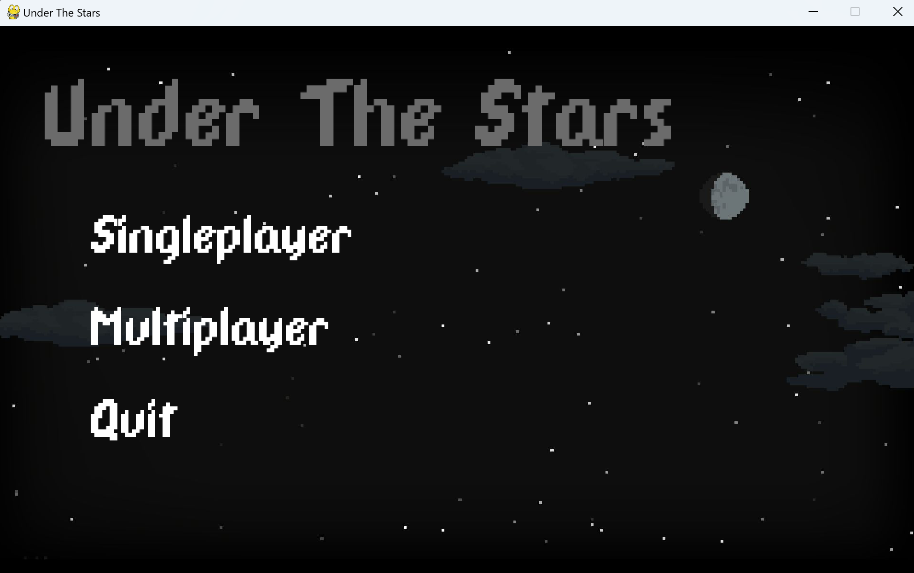
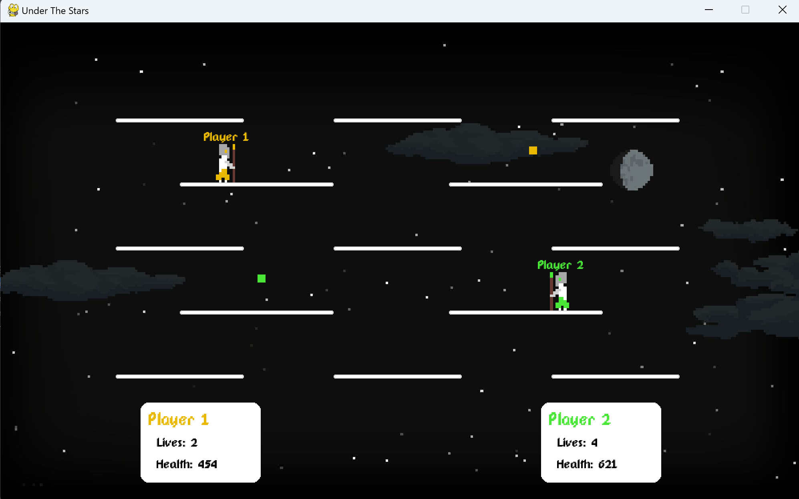
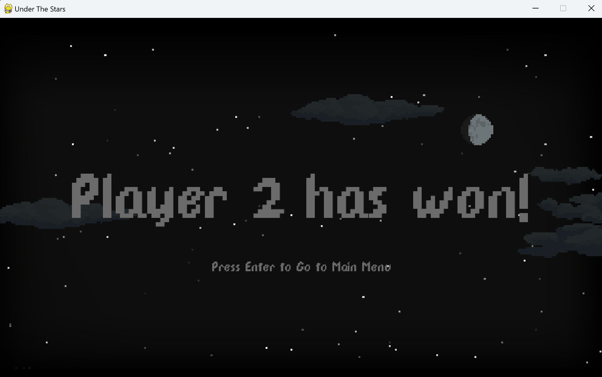

# Under The Stars (Not Complete)
This is a game you can play with friends. The objective is to have the most lives at the end.

The control keys are:
- "keys"
- "mouse"

Used libraries:
- pygame
- socket
- threading
- random
- json
- math

## Setup

Pre-requirements:

* python 3.9 >

## Run the app

First, make sure that you're in the right directory. If you're not, run
```
cd .../"Slash Mayhem"
```

Open a terminal and run (if you are playing multiplayer)
```
python server.py
```

Open another terminal and run

```shell
python main.py
```

If you have another computer, run the same line again on that computer on a terminal (Must be connected to the same wifi). If you don't have another computer, you can open a new terminal and run the line of code again. 

## Troublshooting

- If you are using two (or more) computers, try to turn off the firewall as it may mess up the connection

## Limitations

- Multiplayer isn't done yet

## Screenshots



)
